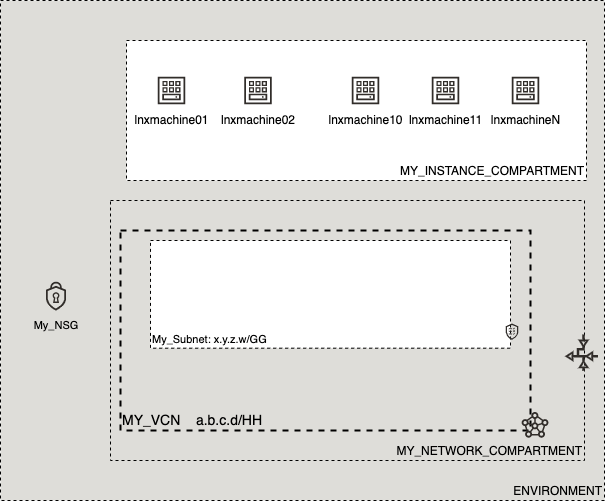

# OCI Cloud Bricks: Linux Compute Instance

[](https://img.shields.io/badge/license-UPL-green) [](https://sonarcloud.io/dashboard?id=oracle-devrel_terraform-oci-cloudbricks-linux-compute)

## Introduction
The following cloud brick enables you to create batches of linux computes, starting from 1 to many associated to a specific compartment and specific subnet.


## Reference Architecture
The following is the reference architecture associated to this brick



In this case, you can take advantage of the decoupled nature of the network compartment and the artifact compartment for cost tracking purposes. 

### Prerequisites
- Pre existent Compartment structure
- Pre existent VCN, Subnet and NSG (if applies)

--- 

## Sample tfvar file

```shell
########## SAMPLE TFVAR FILE ##########
########## PROVIDER SPECIFIC VARIABLES ##########
region           = "foo-region-1"
tenancy_ocid     = "ocid1.tenancy.oc1..abcdefg"
user_ocid        = "ocid1.user.oc1..aaaaaaabcdefg"
fingerprint      = "fo:oo:ba:ar:ba:ar"
private_key_path = "/absolute/path/to/api/key/your_api_key.pem"
########## PROVIDER SPECIFIC VARIABLES ##########


########## ARTIFACT SPECIFIC VARIABLES ##########****
ssh_public_key                   = "./relative/path/to/ssh/key/public_ssh_key.pub"
ssh_private_key                  = "./relative/path/to/ssh/key/private_ssh_key"
ssh_public_is_path               = true
ssh_private_is_path              = true
compute_availability_domain_list = ["aBCD:foo-REGION-1-AD-1", "aBCD:foo-REGION-1-AD-2","aBCD:foo-REGION-1-AD-3" ]

network_subnet_name                     = "My_Subnet"
assign_public_ip_flag                   = true
fault_domain_name                       = ["FAULT-DOMAIN-1", "FAULT-DOMAIN-2", "FAULT-DOMAIN-3"]
bkp_policy_boot_volume                  = "gold"
linux_compute_instance_compartment_name = "MY_INSTANCE_COMPARTMENT"
linux_compute_network_compartment_name  = "MY_NETWORK_COMPARTMENT"
vcn_display_name                        = "MY_VCN"
num_instances                           = 1
is_nsg_required                         = true
compute_nsg_name                        = "My_NSG"
compute_display_name_base               = "lnxmachine"
instance_image_ocid                     = "ocid1.image.oc1.sa-santiago-1.aaaaaaaa4wkfbnujci2u7tfm2eqhliuunxy2hwesmf5kwsclpamf4xgqs2wa" #Image: Oracle-Autonomous-Linux-7.9-2021.04-0
instance_shape                          = "VM.Standard.E4.Flex"
is_flex_shape                           = true
instance_shape_config_ocpus             = 1
instance_shape_config_memory_in_gbs     = 16
########## ARTIFACT SPECIFIC VARIABLES ##########


########## SAMPLE TFVAR FILE ##########
```

### Variable specific considerations

- Specific SSH Keys can be used for creating compute in batches. These can be included inside the same system from where brick module is being used. 
- Is possible to use as many AD as are available on the region currently in use. These can be passed on separated by commas and enclosed by double quotes
- Any boot volume backup policy available in your tenancy can be used, whereas this can be default or a custom one
- The number of instances can be overriden by providing a number on variable num_instances. This variable can never be less than 1
- NSG creation is optonal. If NSG is required or not for your instance. If NSG is required for instance, provide variable `is_nsg_required` as true and pass on an NSG Name on variable `compute_nsg_name`. Otherwise, set `is_nsg_required` as false and either drop/delete the variable `compute_nsg_name` or blank it out by passing `""` as argument
- A full OCID of the image wanted to be used to create compute is required. A full list of OCID is available in the [following link](https://docs.oracle.com/en-us/iaas/images/)
- If FLEX image is required, variable `is_flex_shape` should be set to `true`
  - Mandatory `instance_shape_config_ocpu` and `instance_shape_config_memory_in_gbs` are required when flex image is in use
  - If instance_shape is not flex, variable `is_flex_shape` should be set to `false` and then drop the usage of `instance_shape_config_ocpu` and `instance_shape_config_memory_in_gbs` variables by drop/delete or passing out `""` as argument

---

## Variable documentation
## Requirements

| Name | Version |
|------|---------|
| <a name="requirement_terraform"></a> [terraform](#requirement\_terraform) | >= 0.13.5 |

## Providers

| Name | Version |
|------|---------|
| <a name="provider_oci"></a> [oci](#provider\_oci) | 4.35.0 |
| <a name="provider_oci.home"></a> [oci.home](#provider\_oci.home) | 4.35.0 |
| <a name="provider_random"></a> [random](#provider\_random) | 3.1.0 |

## Modules

No modules.

## Resources

| Name | Type |
|------|------|
| [oci_core_instance.Compute](https://registry.terraform.io/providers/hashicorp/oci/latest/docs/resources/core_instance) | resource |
| [oci_core_volume_backup_policy_assignment.backup_policy_assignment_BootVolume](https://registry.terraform.io/providers/hashicorp/oci/latest/docs/resources/core_volume_backup_policy_assignment) | resource |
| [oci_identity_tag.release](https://registry.terraform.io/providers/hashicorp/oci/latest/docs/resources/identity_tag) | resource |
| [oci_identity_tag_namespace.devrel](https://registry.terraform.io/providers/hashicorp/oci/latest/docs/resources/identity_tag_namespace) | resource |
| [random_id.tag](https://registry.terraform.io/providers/hashicorp/random/latest/docs/resources/id) | resource |
| [oci_core_network_security_groups.NSG](https://registry.terraform.io/providers/hashicorp/oci/latest/docs/data-sources/core_network_security_groups) | data source |
| [oci_core_subnets.SUBNET](https://registry.terraform.io/providers/hashicorp/oci/latest/docs/data-sources/core_subnets) | data source |
| [oci_core_vcns.VCN](https://registry.terraform.io/providers/hashicorp/oci/latest/docs/data-sources/core_vcns) | data source |
| [oci_core_volume_backup_policies.BACKUPPOLICYBOOTVOL](https://registry.terraform.io/providers/hashicorp/oci/latest/docs/data-sources/core_volume_backup_policies) | data source |
| [oci_identity_compartments.COMPARTMENTS](https://registry.terraform.io/providers/hashicorp/oci/latest/docs/data-sources/identity_compartments) | data source |
| [oci_identity_compartments.NWCOMPARTMENTS](https://registry.terraform.io/providers/hashicorp/oci/latest/docs/data-sources/identity_compartments) | data source |
| [oci_identity_region_subscriptions.home_region_subscriptions](https://registry.terraform.io/providers/hashicorp/oci/latest/docs/data-sources/identity_region_subscriptions) | data source |

## Inputs

| Name | Description | Type | Default | Required |
|------|-------------|------|---------|:--------:|
| <a name="input_assign_public_ip_flag"></a> [assign\_public\_ip\_flag](#input\_assign\_public\_ip\_flag) | Defines either machine will have or not a Public IP assigned. All Pvt networks this variable must be false | `bool` | `false` | no |
| <a name="input_bkp_policy_boot_volume"></a> [bkp\_policy\_boot\_volume](#input\_bkp\_policy\_boot\_volume) | Describes the backup policy attached to the boot volume | `string` | `"gold"` | no |
| <a name="input_compute_availability_domain_list"></a> [compute\_availability\_domain\_list](#input\_compute\_availability\_domain\_list) | Defines the availability domain list where OCI artifact will be created. This is a numeric value greater than 0 | `list(any)` | n/a | yes |
| <a name="input_compute_display_name_base"></a> [compute\_display\_name\_base](#input\_compute\_display\_name\_base) | Defines the compute and hostname Label for created compute | `any` | n/a | yes |
| <a name="input_compute_nsg_name"></a> [compute\_nsg\_name](#input\_compute\_nsg\_name) | Name of the NSG associated to the compute | `any` | n/a | yes |
| <a name="input_fault_domain_name"></a> [fault\_domain\_name](#input\_fault\_domain\_name) | Describes the fault domain to be used by machine | `list(any)` | <pre>[<br>  "FAULT-DOMAIN-1",<br>  "FAULT-DOMAIN-2",<br>  "FAULT-DOMAIN-3"<br>]</pre> | no |
| <a name="input_fingerprint"></a> [fingerprint](#input\_fingerprint) | API Key Fingerprint for user\_ocid derived from public API Key imported in OCI User config | `any` | n/a | yes |
| <a name="input_instance_image_ocid"></a> [instance\_image\_ocid](#input\_instance\_image\_ocid) | Defines the OCID for the OS image to be used on artifact creation. Extract OCID from: https://docs.cloud.oracle.com/iaas/images/ or designated custom image OCID created by packer | `any` | n/a | yes |
| <a name="input_instance_shape"></a> [instance\_shape](#input\_instance\_shape) | Defines the shape to be used on compute creation | `any` | n/a | yes |
| <a name="input_instance_shape_config_memory_in_gbs"></a> [instance\_shape\_config\_memory\_in\_gbs](#input\_instance\_shape\_config\_memory\_in\_gbs) | (Updatable) The total amount of memory available to the instance, in gigabytes. | `string` | `""` | no |
| <a name="input_instance_shape_config_ocpus"></a> [instance\_shape\_config\_ocpus](#input\_instance\_shape\_config\_ocpus) | (Updatable) The total number of OCPUs available to the instance. | `string` | `""` | no |
| <a name="input_is_flex_shape"></a> [is\_flex\_shape](#input\_is\_flex\_shape) | Boolean that describes if the shape is flex or not | `bool` | `false` | no |
| <a name="input_is_nsg_required"></a> [is\_nsg\_required](#input\_is\_nsg\_required) | Boolean that describes if an NSG is associated to the machine | `bool` | `false` | no |
| <a name="input_label_zs"></a> [label\_zs](#input\_label\_zs) | Auxiliary variable to concatenate with compute number | `list(any)` | <pre>[<br>  "0",<br>  ""<br>]</pre> | no |
| <a name="input_linux_compute_instance_compartment_name"></a> [linux\_compute\_instance\_compartment\_name](#input\_linux\_compute\_instance\_compartment\_name) | Defines the compartment name where the infrastructure will be created | `any` | n/a | yes |
| <a name="input_linux_compute_network_compartment_name"></a> [linux\_compute\_network\_compartment\_name](#input\_linux\_compute\_network\_compartment\_name) | Defines the compartment where the Network is currently located | `any` | n/a | yes |
| <a name="input_network_subnet_name"></a> [network\_subnet\_name](#input\_network\_subnet\_name) | Defines the subnet display name where this resource will be created at | `any` | n/a | yes |
| <a name="input_num_instances"></a> [num\_instances](#input\_num\_instances) | Amount of instances to create | `number` | `0` | no |
| <a name="input_primary_vnic_display_name"></a> [primary\_vnic\_display\_name](#input\_primary\_vnic\_display\_name) | Defines the Primary VNIC Display Name | `string` | `"primaryvnic"` | no |
| <a name="input_private_ip"></a> [private\_ip](#input\_private\_ip) | Describes the private IP required for machine | `any` | `null` | no |
| <a name="input_private_key_path"></a> [private\_key\_path](#input\_private\_key\_path) | Private Key Absolute path location where terraform is executed | `any` | n/a | yes |
| <a name="input_region"></a> [region](#input\_region) | Target region where artifacts are going to be created | `any` | n/a | yes |
| <a name="input_ssh_private_is_path"></a> [ssh\_private\_is\_path](#input\_ssh\_private\_is\_path) | Describes if SSH Private Key is located on file or inside code | `bool` | `false` | no |
| <a name="input_ssh_private_key"></a> [ssh\_private\_key](#input\_ssh\_private\_key) | Private key to log into machine | `any` | n/a | yes |
| <a name="input_ssh_public_is_path"></a> [ssh\_public\_is\_path](#input\_ssh\_public\_is\_path) | Describes if SSH Public Key is located on file or inside code | `bool` | `false` | no |
| <a name="input_ssh_public_key"></a> [ssh\_public\_key](#input\_ssh\_public\_key) | Defines SSH Public Key to be used in order to remotely connect to compute instance | `string` | n/a | yes |
| <a name="input_tenancy_ocid"></a> [tenancy\_ocid](#input\_tenancy\_ocid) | OCID of tenancy | `any` | n/a | yes |
| <a name="input_user_ocid"></a> [user\_ocid](#input\_user\_ocid) | User OCID in tenancy. | `any` | n/a | yes |
| <a name="input_vcn_display_name"></a> [vcn\_display\_name](#input\_vcn\_display\_name) | VCN Display name to execute lookup | `any` | n/a | yes |

## Outputs

| Name | Description |
|------|-------------|
| <a name="output_instance"></a> [instance](#output\_instance) | Compute Generated |
| <a name="output_instance_private_ip"></a> [instance\_private\_ip](#output\_instance\_private\_ip) | Compute Private IP |
| <a name="output_server_display_name"></a> [server\_display\_name](#output\_server\_display\_name) | Compute Display Name |

## Contributing
This project is open source.  Please submit your contributions by forking this repository and submitting a pull request!  Oracle appreciates any contributions that are made by the open source community.

## License
Copyright (c) 2021 Oracle and/or its affiliates.

Licensed under the Universal Permissive License (UPL), Version 1.0.

See [LICENSE](LICENSE) for more details.
